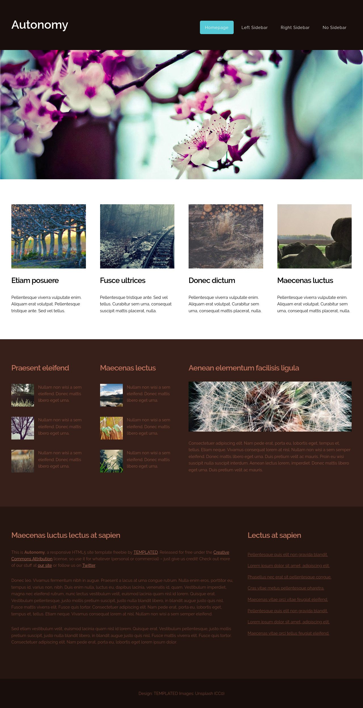

# Autonomy Site Simples
Este é um projeto de website chamado "Autonomy", criado utilizando HTML e CSS. O site é responsivo e apresenta um design moderno e elegante, ideal para servir como modelo para projetos pessoais ou comerciais.



## Visão Geral

O projeto "Autonomy" foi desenvolvido para servir como um template básico de site responsivo, utilizando HTML5 e CSS3. O site é composto por um cabeçalho com um menu de navegação, uma imagem principal, seções de artigos e informações adicionais, e um rodapé.

### Layout

- **Cabeçalho:** Contém o título do site e um menu de navegação.
- **Imagem Principal:** Uma imagem de boas-vindas ocupa a largura total da página.
- **Seção de Artigos:** Apresenta vários cards com imagens e textos descritivos.
- **Seção de Informações Adicionais:** Contém pequenas descrições acompanhadas de imagens, dispostas em colunas.
- **Rodapé:** Inclui créditos de design e imagens.

## Tecnologias Utilizadas

- **HTML5**
- **CSS3**

## Como usar

1. Clone o repositorio:

```bash
git clone https://github.com/seu-usuario/autonomy.git
```
2. Abra o arquivo index.html no seu navegador:
- Navegue até o diretório do projeto e abra o arquivo index.html com seu navegador preferido.

## Contribuição
Sinta-se à vontade para contribuir com o projeto. Para isso:
1. Faça um fork do projeto.
2. Crie uma nova branch para suas alterações (git checkout -b feature/nova-feature).
3. Commit suas alterações (git commit -m 'Adiciona nova feature').
4. Envie para a branch (git push origin feature/nova-feature).
5. Crie um Pull Request.